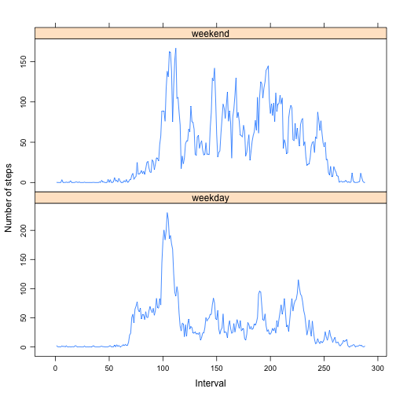

# Reproducible Research: Peer Assessment 1

## Loading and preprocessing the data

```r
# Set working directory
setwd("/Users/koo7604/Desktop/R/Johns_Hopkins/ReproducibleResearch/week2/RepData_PeerAssessment1")
# Load packages
library(knitr)
library(markdown)
# Load the data
DT <- read.csv("activity.csv") 
# Remove NA records
DT$date <- as.Date(DT$date)
DT2 <- na.omit(DT)
```

## What is mean total number of steps taken per day?

```r
# Aggregate step by each day
x <- aggregate(DT2$steps, by=list(DT2$date), FUN=sum)
# Make histogram
hist1 <- hist(x[,2], main="Number of steps taken per day", xlab = "Number of steps")
```

 

```r
# Calculate mean and median
mean(x[,2])
```

```
## [1] 10766
```

```r
median(x[,2])
```

```
## [1] 10765
```

## What is the average daily activity pattern?

```r
# Calculate average step by each interval
y <- aggregate(DT2$steps, by=list(DT2$interval), FUN=mean)
names(y) <- c("interval", "numsteps")
# Make line plot
plot(y$interval, y$numsteps, type="l", xlab="Interval", ylab="Number of steps")
```

 

```r
# Which 5-minute interval, on average across all the days in the dataset, contains the maximum number of steps?
subset(y$interval, y$numsteps==max(y$numsteps))
```

```
## [1] 835
```

## Imputing missing values

```r
x <- sapply(DT, function(x) sum(is.na(x)))
z <- aggregate(DT2$steps, by=list(DT2$interval), FUN=mean)
maxrow <- nrow(DT)
# Fill mean steps by interval into NAs
for (i in 1:maxrow){
        if (is.na(DT[i,1])){
                DT[i,1] <- subset(z[,2], z[,1]==DT[i,3])
        }
}
# Make histogram from new dataset
x <- aggregate(DT$steps, by=list(DT$date), FUN=sum)
hist2 <- hist(x[,2], main="Number of steps taken per day 2", xlab = "Number of steps")
```

 

```r
mean(x[,2]) # mean
```

```
## [1] 10766
```

```r
median(x[,2]) # median
```

```
## [1] 10766
```
### Mean is the same but median differ from the estimates from the first part. Median and mean become same here.


## Are there differences in activity patterns between weekdays and weekends?

```r
library(chron) #Call chron package to use is.weekend(x)
maxrow <- nrow(DT)

# Fill in weekend/weekday flag
for (i in 1:maxrow) {DT[i,4] <- 
        if (is.weekend(DT[i,2])){"weekend"}
        else {"weekday"}
}

# Create column name for weekend/weekday
colnames(DT) <- c(colnames(DT[1]),colnames(DT[2]), colnames(DT[3]), "weekend")

# Calculate average steps for all weekend days
DTend <- aggregate(DTend$steps, by=list(DTend$interval), FUN=mean, subset=subset(DT, DT$weekend=="weekend"))
```

```
## Error: no rows to aggregate
```

```r
colnames(DTend) <- c("interval", "avenumsteps")

# Calculate average steps for all weekday days
DTday <- aggregate(DTday$steps, by=list(DTday$interval), FUN=mean, subset = subset(DT, DT$weekend=="weekday"))
```

```
## Error: no rows to aggregate
```

```r
colnames(DTday) <- c("interval", "avenumsteps")

# Combine
DT3 <- cbind(DTend, DTday$avenumsteps)
colnames(DT3) <- c("interval", "weekend", "weekday")

# Transform tp time series data
DT3 <- ts(DT3[,2:3], start=0, frequency = 1)

# Plot time series
library(lattice)
xyplot(DT3, screens=c("weekend", "weekday"), xlab = "Interval", ylab = "Number of steps")
```

 
